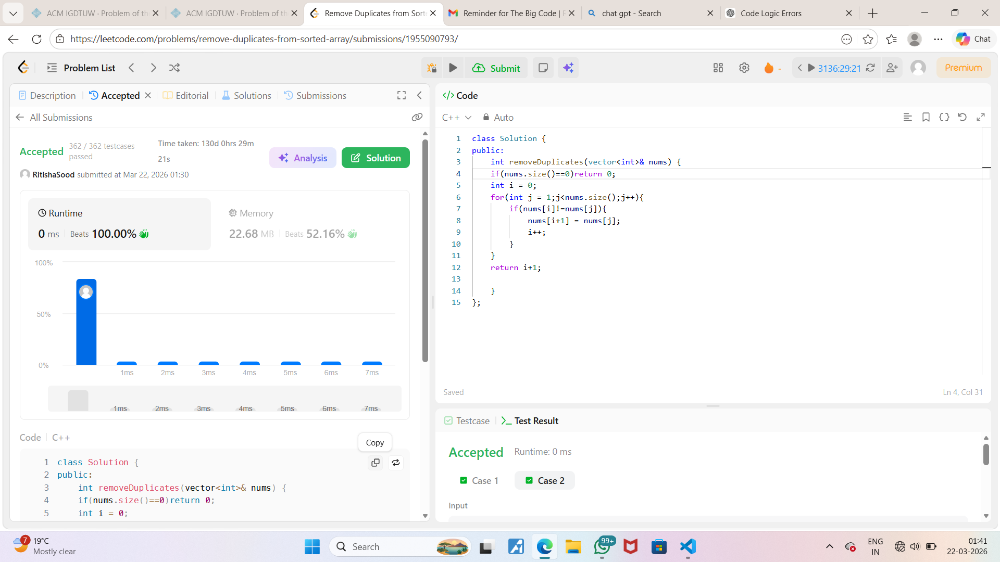

# Day 1 - LeetCode Problem

## 🧩 Problem Name
Remove Duplicates from Sorted Array

## 🔗 Problem Link
https://leetcode.com/problems/remove-duplicates-from-sorted-array/

## 📝 Approach
- Used two pointer technique
- One pointer tracks unique elements
- Second pointer scans array

## 💻 Code
```cpp
class Solution {
public:
    int removeDuplicates(vector<int>& nums) {
        int i = 0;
        for(int j = 1; j < nums.size(); j++) {
            if(nums[j] != nums[i]) {
                i++;
                nums[i] = nums[j];
            }
        }
        return i + 1;
    }
};


### OR if different name:
```md

